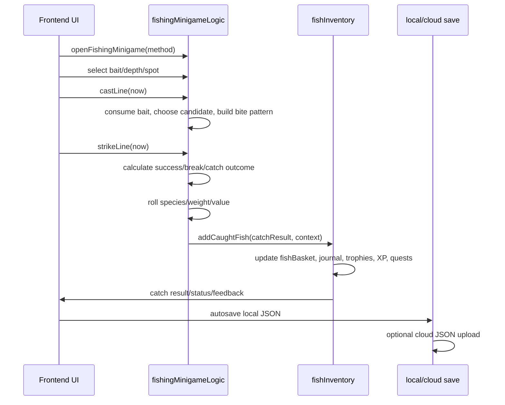

# Server-Authoritative Migration Plan

Date: 2026-07-02

Branch: `codex/server-authoritative-architecture-plan`

## Summary

The current game is client-authoritative. The frontend owns the player's money, inventory, fish storage, catch outcomes, market pricing, quest/order progress, purchases, profile progression, local save, and the cloud-save JSON payload. The backend currently appears to provide auth/profile identity and cloud-save storage only through the client API wrappers in `src/api`.

The target architecture should gradually move important game state and calculations to the backend while keeping the frontend responsible for rendering, input, animations, temporary UI state, and offline/local fallback.

Recommended first milestone: **server-authoritative catch result** behind a disabled feature flag, with the existing local catch flow kept as fallback.

## 1. Current Frontend-Owned State

| System | Current file(s) | Current owner | Move to backend? | Priority | Risk |
| --- | --- | --- | --- | --- | --- |
| Coins/money | `src/game/state.js`, `src/game/economy.js`, `src/game/fishInventory.js`, `src/game/quests.js`, `src/game/cafeOrders.js` | Frontend state, local save, cloud JSON | Yes | High | High: direct economy cheating risk. |
| Inventory/items | `src/game/state.js`, `src/game/inventory.js`, `src/game/fishInventory.js`, `src/game/economy.js` | Frontend state, local save, cloud JSON | Yes | High | High: affects bait, purchases, progression. |
| Fish storage/keepnet/sadok | `src/game/fishInventory.js`, `src/game/state.js` | Frontend `fishBasket`, local save, cloud JSON | Yes | High | High: leaderboard/economy source data. |
| Caught fish records | `src/game/fishInventory.js`, `src/game/fishingMinigameLogic.js` | Frontend generated entries | Yes | High | High: fish id, weight, trophy, value are client-generated. |
| Fish weight/value | `src/game/fishData.js`, `src/game/fishSizeProfiles.js`, `src/game/market.js`, `src/game/fishEconomy.js` | Frontend calculation | Yes | High | High: balance and anti-cheat. |
| Catch probability | `src/game/fishingMinigameLogic.js`, `src/game/bitePatterns.js`, `src/game/waterFishDistribution.js` | Frontend calculation using `Math.random()` | Yes | High | High: core game outcome is client-owned. |
| Bait/tackle/rod effects | `src/game/fishingMinigameLogic.js`, `src/game/tackle.js`, `src/game/bitePatterns.js` | Frontend calculation | Yes | High | High: affects catch chance/weight. |
| Shop purchases | `src/game/economy.js`, `src/game/state.js` (`shopItems`) | Frontend mutates coins/purchased/inventory | Yes | High | High: coin spending and unlocks are trusted locally. |
| Cafe orders | `src/game/cafeOrders.js` | Frontend templates, timers, completion, rewards | Yes | Medium | Medium/high: economy reward and fish consumption. |
| Quests | `src/game/quests.js` | Frontend progress/rewards | Yes | Medium | Medium: unlocks and rewards are local. |
| Location unlocks | `src/game/locations.js`, `src/game/travel.js`, `src/game/economy.js`, `src/game/quests.js` | Frontend travel/progress state | Yes | Medium | Medium: gates content and fish access. |
| Player profile | `src/game/profile.js`, `src/game/state.js`, `src/api/authApi.js` | Gameplay profile local; auth profile backend | Yes | Medium | Medium: display/profile can migrate before economy. |
| XP/level | `src/game/profile.js`, `src/game/fishInventory.js` | Frontend local profile fields | Maybe later | Low | Low now because progression is not designed as central. |
| Achievements/flags | `src/game/achievementStars.js`, `src/game/fishInventory.js`, `src/game/profile.js` | Frontend derived and saved | Yes for competitive/account-wide | Medium | Medium: trophy stars can affect leaderboards. |
| Save payload | `src/game/save.js` | Frontend localStorage JSON | Keep fallback; backend later authoritative state | High | High: currently the whole truth is editable client JSON. |
| Cloud save payload | `src/main.js`, `src/api/saveApi.js` | Backend stores client JSON blob | Yes, evolve to state sync/revisions | High | High: cloud save stores whatever client sends. |

## 2. Static Dictionaries and Balancing Data

| Dictionary/config | Current location | Backend-provided later? | Frontend cache? | Anti-cheat/balance impact |
| --- | --- | --- | --- | --- |
| Fish species | `src/game/fishData.js` | Yes | Yes, versioned config | High: species rarity/value/weight bounds. |
| Fish size profiles | `src/game/fishSizeProfiles.js` | Yes | Yes | High: trophy and leaderboard weights. |
| Fish prices | `src/game/fishEconomy.js`, `src/game/market.js` | Yes | Yes | High: economy balance. |
| Water/fish distribution | `src/game/waterFishDistribution.js` | Yes | Yes | High: catch probability and location balance. |
| Bite patterns/tuning | `src/game/bitePatterns.js` | Eventually | Yes | Medium/high: affects timing and success. |
| Locations/unlocks | `src/game/locations.js`, `src/game/guideData.js` | Yes | Yes | Medium/high: content gates and fish pools. |
| Bait and inventory ids | `src/game/inventory.js`, `src/game/state.js` | Yes | Yes | Medium/high: input to catch and shop. |
| Rod/tackle effects | `src/game/tackle.js` | Yes | Yes | High: catch chance, break chance, weight bonus. |
| Shop items/prices | `src/game/state.js` (`shopItems`) | Yes | Yes | High: economy and unlock balance. |
| Cafe order definitions | `src/game/cafeOrders.js` | Yes | Yes | Medium/high: rewards and fish sink. |
| Quest definitions | `src/game/quests.js` | Yes | Yes | Medium: rewards and unlocks. |
| Market trend constants | `src/game/market.js` | Yes | Yes | Medium/high: sale value balance. |
| Tutorial/starter tackle constants | `src/game/starterTackleDrawer.js`, `src/game/profile.js` | Eventually | Yes | Low/medium: onboarding state. |

Static config can be served by `GET /api/game/config` and cached locally with a schema version/hash. The backend should use the same authoritative config for calculations. The frontend can keep a cached copy for rendering, labels, offline fallback, and optimistic UI, but it should not be trusted for important rewards.

## 3. Current Fishing Calculation Path

Current flow:

1. Player opens fishing.
   - `openFishingMinigame` validates local items/tackle and creates `state.ui.fishingMinigame`.
2. Player selects bait/depth/spot.
   - `selectFishingBait`, `selectFishingDepth`, `selectFishingSpot` mutate UI/local state.
3. Player casts.
   - `castLine` consumes bait locally, advances time, picks `fishCandidateId` with `chooseFishCandidate`, builds bite checks/patterns, and schedules bobber phases.
4. Bobber/minigame runs.
   - `tickFishingMinigame` advances idle, bite checks, bite cycles, strike windows, and no-bite outcomes.
5. Player strikes.
   - `strikeLine` calculates reaction quality, tackle bonus, bait bonus, fish difficulty, success chance, line-break chance, rod-break chance, and random roll locally.
6. If caught:
   - `rollFishById` and `rollFishWeight` generate fish id/weight.
   - Depth/water adjustments run locally.
   - `getFreshFishValue`/market logic calculates value.
   - `addCaughtFish` writes a fish entry into `fishBasket`.
   - Journal, trophies, achievements, profile stats, XP, quest progress, and inventory mirror values are updated locally.
7. Save update:
   - HUD/autosave detects state changes, stores local save, and later uploads the full JSON blob to cloud if logged in.

Mermaid sequence:



## 4. Proposed Server-Owned API Shape

The long-term model can support a richer session flow:

- `POST /api/game/fishing/start`
- `POST /api/game/fishing/action`
- `POST /api/game/fishing/finish`

However, the simplest practical first step is:

- `POST /api/game/catch/resolve`

This lets the frontend keep the existing bobber UI and timing locally, then send a compact action result to the server. The server returns the authoritative catch result and updated player state patch. If the server is unavailable, the client keeps the existing local flow as fallback and can mark the result as local/unverified later.

## 5. Future Ownership Table

| System | Current owner | Future owner | Frontend responsibility | Backend responsibility | Priority |
| --- | --- | --- | --- | --- | --- |
| Profile | Local save plus auth profile | Backend account profile | Render/edit display fields; offline draft | Store account profile; migrate guest profile | Medium |
| Cloud save | Backend stores client JSON | Backend state/revision service | Local fallback and conflict UI | Authoritative revisions, merge/conflict metadata | High |
| Coins | Frontend | Backend | Render balance | Validate and mutate balance | High |
| Inventory | Frontend | Backend | Render inventory and offline fallback | Validate item counts and mutations | High |
| Fish storage | Frontend | Backend | Render keepnet/storage | Store fish entries, statuses, values | High |
| Catch result | Frontend | Backend | Send context/action score; render result | Roll/validate species, weight, rewards, patch state | High |
| Shop purchase | Frontend | Backend | Send item id; render response | Validate price, balance, ownership, inventory patch | High |
| Cafe orders | Frontend | Backend | Render available orders/timers | Generate orders, validate completion, pay rewards | Medium |
| Quests | Frontend | Backend | Render progress/rewards | Track progress and grant rewards/unlocks | Medium |
| Leaderboard | Not authoritative | Backend | Display rankings | Validate submissions and aggregate records | High |
| Achievements | Frontend | Backend for account/competitive | Render badges/stars | Validate trophy/star unlocks if meaningful | Medium |
| Static dictionaries | Frontend constants | Backend config with frontend cache | Cache/render config | Serve versioned config used by calculations | Medium |
| Bobber animation | Frontend | Frontend | Animate and collect action quality | Optionally validate timing/session events later | Low |
| Random events | Frontend | Mixed | Render ambience/local flavor | Own reward-bearing random events | Medium |

## 6. First Migration Milestone

Preferred milestone: **server-authoritative catch result**.

Frontend sends:

- player id/session via auth token
- location id
- selected bait
- selected rod/tackle
- selected depth/spot if needed
- client action score or timing quality
- local save revision

Backend returns:

- caught/fail
- fish species
- weight
- value
- rewards
- updated coins/inventory/fish storage summary or patch
- server timestamp
- revision

Frontend behavior:

- If `SERVER_AUTHORITATIVE_CATCH=false`, keep current local flow.
- If enabled and server succeeds, render server result and apply server patch.
- If enabled and server fails, keep local flow for now and mark/debug-log as fallback if needed.

Why this first:

- It targets the most important anti-cheat point.
- It does not require redesigning all UI.
- It can be feature-flagged and tested safely.
- It creates the pattern for future shop/sell/quest mutations.

## 7. Draft API Contracts

### POST `/api/game/catch/resolve`

Request:

```json
{
  "locationId": "canal",
  "baitId": "worms",
  "rodId": "simple_stick_rod",
  "tackle": {
    "line": "grandma_thread",
    "hook": "old_dull_hook",
    "sinker": "small_stone",
    "float": "goose_feather_float"
  },
  "spotId": "shallow_weeds",
  "depth": "middle",
  "clientActionScore": 0.82,
  "localSaveRevision": 12
}
```

Response:

```json
{
  "ok": true,
  "result": {
    "caught": true,
    "fish": {
      "id": "crucian",
      "name": "Crucian",
      "weightKg": 1.24,
      "rarity": "common",
      "value": 120
    },
    "rewards": {
      "coins": 120,
      "xp": 10
    },
    "playerStatePatch": {
      "coins": 1450,
      "fishCaughtTotal": 32,
      "inventory": {
        "worms": 24
      },
      "fishStorageSummary": {
        "fresh": 8,
        "liveBait": 1
      }
    },
    "serverTimestamp": "2026-07-02T09:00:00.000Z",
    "serverRevision": 13
  }
}
```

### GET `/api/game/config`

Response:

```json
{
  "ok": true,
  "configVersion": "2026-07-02.1",
  "fish": [],
  "items": [],
  "locations": [],
  "shops": [],
  "quests": [],
  "cafeOrders": [],
  "balance": {
    "fishPrices": {},
    "biteTuning": {}
  }
}
```

### POST `/api/game/shop/buy`

Request:

```json
{
  "itemId": "properRod",
  "localSaveRevision": 13
}
```

Response:

```json
{
  "ok": true,
  "result": {
    "purchased": true,
    "itemId": "properRod",
    "playerStatePatch": {
      "coins": 650,
      "purchased": {
        "properRod": true
      },
      "tackle": {
        "owned": {
          "proper_rod": true
        }
      }
    },
    "serverRevision": 14
  }
}
```

### POST `/api/game/fish/sell`

Request:

```json
{
  "fishEntryIds": ["fish-1", "fish-2"],
  "saleMode": "selected",
  "localSaveRevision": 14
}
```

Response:

```json
{
  "ok": true,
  "result": {
    "sold": 2,
    "coinsEarned": 180,
    "playerStatePatch": {
      "coins": 830,
      "fishStorageSummary": {
        "fresh": 6
      },
      "totalCoinsEarned": 2450
    },
    "serverRevision": 15
  }
}
```

### GET `/api/game/profile`

Response:

```json
{
  "ok": true,
  "profile": {
    "playerId": "player_123",
    "displayName": "Ivasik",
    "avatarId": "grandson-1",
    "createdAt": "2026-07-02T09:00:00.000Z",
    "serverRevision": 15
  }
}
```

### POST `/api/game/profile/sync`

Request:

```json
{
  "displayName": "Ivasik",
  "avatarId": "grandson-1",
  "localGuestId": "guest_abc",
  "localSaveRevision": 15
}
```

Response:

```json
{
  "ok": true,
  "profile": {
    "playerId": "player_123",
    "displayName": "Ivasik",
    "avatarId": "grandson-1"
  },
  "serverRevision": 16
}
```

### GET `/api/leaderboard/biggest-fish`

Response:

```json
{
  "ok": true,
  "type": "biggest-fish",
  "rows": [
    {
      "rank": 1,
      "playerName": "Ivasik",
      "fishId": "som",
      "weightKg": 18.4,
      "locationId": "mining_lake",
      "caughtAt": "2026-07-02T09:00:00.000Z"
    }
  ]
}
```

## 8. Frontend Preparation Added

Added:

- `src/api/gameApi.js`
  - `resolveCatchOnServer(payload)`
  - `fetchGameConfig()`
  - `buyItemOnServer(payload)`
  - `sellFishOnServer(payload)`
  - `fetchGameProfile()`
  - `syncGameProfile(payload)`
  - `fetchLeaderboard(type)`
- `src/config/featureFlags.js`
  - `SERVER_AUTHORITATIVE_CATCH`
  - default: `false`
  - env override: `VITE_SERVER_AUTHORITATIVE_CATCH=true`

These functions are not wired into gameplay yet. They use the existing `apiRequest` and auth-token behavior and fail safely by returning `{ ok: false, error }`.

## 9. Backend Availability

Backend code was not found in this repository. The repo contains frontend code and API wrappers under `src/api`, but no backend route/server implementation directory.

Current backend integration from this repo:

- `POST /auth/register`
- `POST /auth/login`
- `POST /auth/refresh`
- `GET /profile/me`
- `GET /save/load`
- `GET /save/status`
- `POST /save/sync`

The game endpoints above should be implemented in the separate backend repository/service later. No Railway dashboard or manual infrastructure change is required for this planning/scaffolding step.

## 10. Recommended Next Implementation Step

Implement the backend endpoint skeleton for `POST /api/game/catch/resolve` in the backend service, then add an opt-in frontend path:

1. Keep `SERVER_AUTHORITATIVE_CATCH=false` by default.
2. Add a tiny branch in `strikeLine` that calls `resolveCatchOnServer` only when enabled and logged in.
3. On success, apply `playerStatePatch` and render the server result.
4. On failure, fall back to the existing local catch calculation.
5. Add a visible debug/local-unverified marker only for testing builds.

After catch resolution works, migrate `POST /api/game/shop/buy` and `POST /api/game/fish/sell`, because those are the next highest-risk economy mutations.
